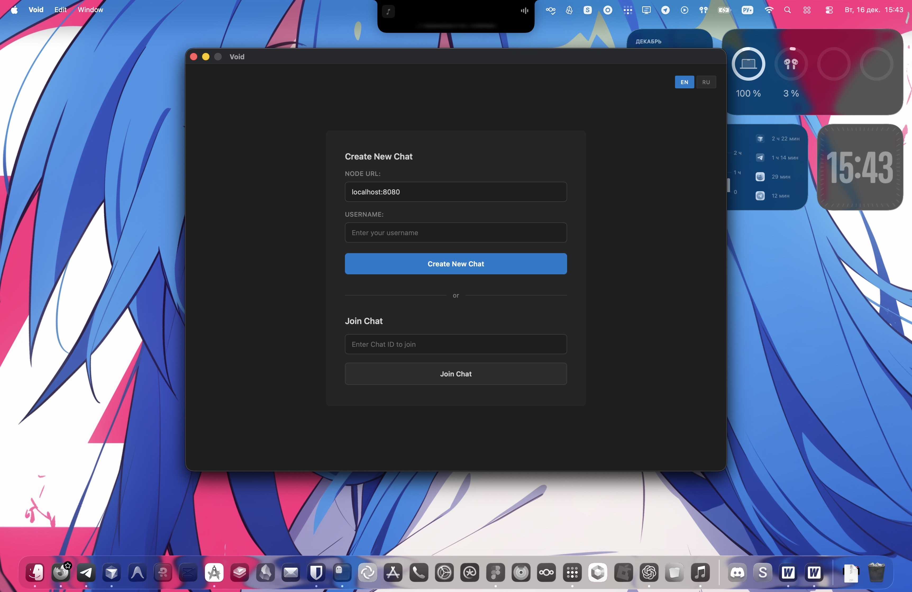

<div align="center">
  

  # Void

  Secure peer-to-peer chat with end-to-end encryption. The server routes messages but can't read them. Bulletproof.

  [](https://www.gnu.org/licenses/gpl-3.0)
  [](https://golang.org/)
  [](https://wails.io/)
  [](https://github.com)
  [](https://protobuf.dev/)
  [](https://nacl.cr.yp.to/)

  [Features](#features) • [Installation](#installation) • [Usage](#usage) • [Development](#development) • [Security](#security) • [License](#license)
</div>

## Screenshot

<div align="center">
  
  <p><em>Void chat interface - dark theme, minimal design</em></p>
</div>

## Features

### Security
- End-to-end encryption with NaCl Box. Industry standard crypto that actually works.
- The server literally can't read your messages. It just passes encrypted blobs around.
- TOFU protection detects if someone tries to swap keys on you (MITM attack).
- Every message is encrypted individually for each recipient. No shortcuts.
- Keys generated with proper crypto randomness. No weak random here.

### Chat Rooms
- Rooms die when everyone leaves. No persistence, no logs, no traces.
- Totally private. You can't browse rooms. You need the exact ID to join.
- No directory, no discovery, no "public rooms". Just private chats.
- Share the room ID through whatever channel you trust. That's it.

### Communication
- Protocol Buffers for compact, fast message encoding
- Messages arrive instantly. No delays, no queues.
- See who's online right now in the room
- Get notified when people join or leave

### Interface
- Dark theme that doesn't hurt your eyes
- Minimal UI that gets out of the way
- Room IDs shown in monospace font, like code
- Messages flow smoothly as they arrive
- Chat scrolls automatically to latest messages

### Languages
- English and Russian out of the box
- Switch languages on the fly
- Easy to add more if you want

### Architecture
- Server runs separately. You control it.
- Code is split into clean modules. Easy to read, easy to change.
- Real encryption, not toy crypto. This is production code.
- Uses standard Go crypto libraries. No sketchy dependencies.

## Installation

### Requirements
- Go 1.23+
- Node.js 18+
- Wails CLI v2

### Build from source

Clone the repository:

```bash
git clone https://github.com/yourusername/Void.git
cd Void
```

Install Wails (if needed):

```bash
go install github.com/wailsapp/wails/v2/cmd/wails@latest
```

Install frontend dependencies:

```bash
cd frontend
npm install
cd ..
```

Build the client:

```bash
wails build
```

The binary will be in `build/bin`.

Build the server:

```bash
go build -o void-server ./cmd/server
```

### Development mode

Run client in dev mode:

```bash
wails dev
```

Run server:

```bash
go run ./cmd/server/main.go -port 8080
```

## Usage

### Starting the server

```bash
./void-server -port 8080
```

Pick any port you want. 8080 is just the default.

### Creating a chat room

1. Fire up the Void client
2. Type in the server address (usually `localhost:8080`)
3. Pick a username
4. Hit "Create New Chat"
5. You get a room ID - copy it
6. Send that ID to whoever you want to chat with

### Joining a chat room

1. Put in the server address and your username
2. Paste the room ID someone gave you
3. Click "Join Chat"
4. Start talking

### Chatting

- Type messages in the bottom box
- Hit Enter or click Send
- Your message gets encrypted automatically
- Only people in the room can read it

### Security verification

First time you connect to someone, their key fingerprint gets saved. If it changes later, you'll get a warning. This catches man-in-the-middle attacks trying to swap keys on you.

## Development

### Project structure

```
Void/
├── internal/
│   ├── client/          # Chat client implementation
│   │   └── client.go
│   ├── server/          # Server implementation
│   │   ├── server.go    # Main server
│   │   ├── room.go      # Room management
│   │   ├── connection.go # Connection handling
│   │   └── utils.go     # Utilities
│   ├── crypto/          # Encryption/decryption
│   │   └── crypto.go
│   └── keyverify/       # Key fingerprint verification
│       └── keyverify.go
├── cmd/
│   └── server/          # Server entry point
│       └── main.go
├── frontend/
│   └── src/             # React frontend
│       ├── App.tsx      # Main component
│       ├── i18n/        # Internationalization
│       └── translations/
├── proto/               # Protocol Buffers definitions
│   ├── chat.proto
│   └── chatpb/
├── app.go               # Wails app bridge
├── main.go              # Client entry point
└── wails.json           # Wails configuration
```

### Stack

**Backend:**
- Go 1.23+
- Wails v2 for desktop app
- Protocol Buffers for serialization
- NaCl Box (Curve25519, XSalsa20, Poly1305) for encryption
- TCP for communication

**Frontend:**
- React
- TypeScript
- Vite
- i18n for translations

### Building

Client:
```bash
wails build
```

Server:
```bash
go build -o void-server ./cmd/server
```

### Code organization

The codebase is split into clear modules:
- `internal/client` - all client-side logic
- `internal/server` - server implementation with separate concerns
- `internal/crypto` - shared encryption utilities
- `internal/keyverify` - key fingerprint handling

Each module has a single responsibility and clean interfaces.

## Security

### Encryption details

We use NaCl Box. That's Curve25519 for key exchange, XSalsa20 to scramble the data, and Poly1305 to make sure nobody tampered with it. This isn't some custom crypto - it's the real deal.

Keys are generated with Go's `crypto/rand`. Proper randomness, not pseudo-random nonsense. Every message gets its own unique nonce. Your private keys stay on your machine and never leave.

### What the server sees

The server operator can see:
- Encrypted blobs (looks like random garbage)
- Room IDs
- Random user IDs (different each session)
- When messages were sent
- How big messages are

But they **cannot** see:
- What you're actually saying
- Your private keys
- Decrypted content
- Who you really are (just random IDs)

### MITM protection

We use Trust-on-First-Use (TOFU). When you first connect to someone, we save their key fingerprint. If it changes later, you get a warning. Someone might be trying to swap keys on you.

For maximum paranoia, verify fingerprints out-of-band. Compare them over a secure channel (Signal, in person, whatever you trust).

### Threat model

**You're protected from:**
- Server operator reading your messages
- Network snoops (everything's encrypted)
- Replay attacks (nonces are unique)
- Message tampering (Poly1305 catches it)

**What the server can see:**
- Metadata: who's talking to whom, when, message sizes
- If you want zero metadata leaks, you'd need true P2P without a server. That's a different architecture.

## License

Licensed under GNU GPL v3.0.

See the LICENSE file for details.

## Contributing

Pull requests welcome. Here's the drill:

1. Fork it
2. Make a branch
3. Write your code
4. Test it
5. Send a PR

Make sure your code:
- Follows Go conventions
- Handles errors properly
- Doesn't break the security model
- Works on macOS, Windows, and Linux

<div align="center">
  <p><strong>Chat securely. Leave no trace.</strong></p>
</div>
